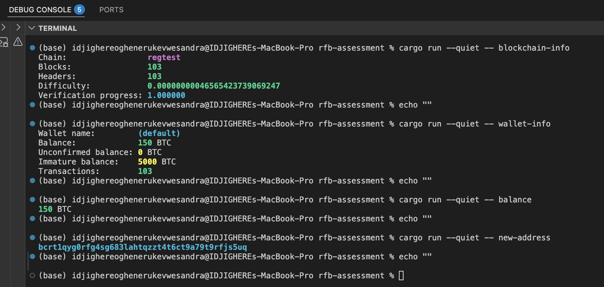

# rfb-cli

A small Rust CLI for talking to a local Bitcoin Core node over JSON-RPC. Built for the Btrust *Rust for Bitcoin* take-home; the original brief lives in [ASSESSMENT.md](./ASSESSMENT.md).

It targets a regtest node running under [Polar](https://lightningpolar.com/) by default, but the config layer works against any Bitcoin Core node reachable over HTTP.



## Getting started

You'll need Rust (I built this against 1.94, edition 2024), Docker, and Polar. Docker just needs to be running; Polar itself is the DMG from [lightningpolar.com](https://lightningpolar.com/). Drag it into `/Applications` — macOS Gatekeeper will refuse to open it the first time because Polar isn't notarized, so head into **System Settings → Privacy & Security** and hit **Open Anyway**.

Once Polar's up, click **Create Network**, name it whatever you like, and set Bitcoin Core to `1` and every Lightning node to `0`. The Lightning nodes aren't needed for this assessment and just slow the first-run Docker pull. Hit **Start** and Polar pulls the `polarlightning/bitcoind` image and boots the container. When the node icon (`backend1`) turns green, click it and grab the RPC values from the **Connect** tab. On a stock Polar setup those come out as:

```
Host:     127.0.0.1
Port:     18443
User:     polaruser
Password: polarpass
```

Those match the CLI's built-in defaults, so if you didn't change anything in Polar you can skip configuration entirely.

A quick way to confirm the node is alive before firing up the Rust binary:

```bash
curl -s --user polaruser:polarpass \
  --data-binary '{"jsonrpc":"1.0","id":"probe","method":"getblockchaininfo","params":[]}' \
  -H 'content-type: text/plain;' \
  http://127.0.0.1:18443/
```

A JSON blob back with `"chain":"regtest"` means you're good to go.

Coinbase rewards need 100 confirmations before they're spendable, and a fresh Polar network only mines 2 blocks. If you want the wallet to have a real balance rather than just immature coins:

```bash
docker exec polar-n1-backend1 bitcoin-cli \
  -regtest -rpcuser=polaruser -rpcpassword=polarpass -generate 101
```

## Building and running

```bash
cargo build --release
```

Or, for day-to-day iteration:

```bash
cargo run -- <subcommand>
```

## Configuration

Three sources for RPC credentials, checked in this order (most specific wins):

1. Command-line flags — `--rpc-url`, `--rpc-user`, `--rpc-password`, `--wallet`
2. Environment variables — `BITCOIN_RPC_URL`, `BITCOIN_RPC_USER`, `BITCOIN_RPC_PASSWORD`, `BITCOIN_WALLET`
3. A TOML file passed with `--config <path>` (or `RFB_CONFIG`)
4. Built-in defaults matching Polar out of the box

A minimal config file looks like this:

```toml
rpc_url      = "http://127.0.0.1:18443"
rpc_user     = "polaruser"
rpc_password = "polarpass"
wallet       = "my-wallet"   # optional
```

I picked this precedence so credentials can live in a config file for daily use, be overridden by an env var in CI, and still be shadowed from the shell for one-off calls without touching either.

## Commands

Terminal output is colored when stdout is a real TTY (chain names in magenta, numbers in green, addresses in cyan) and stripped automatically when piped or redirected. `NO_COLOR=1` disables colors globally.

**`blockchain-info`** — chain, blocks, headers, difficulty, verification progress.

```
$ cargo run -- blockchain-info
Chain:                 regtest
Blocks:                103
Headers:               103
Difficulty:            0.00000000046565423739069247
Verification progress: 1.000000
```

**`wallet-info`** — wallet name, balance, unconfirmed balance, transaction count, plus immature balance (which is usually the interesting number on regtest).

```
$ cargo run -- wallet-info
Wallet name:         (default)
Balance:             150 BTC
Unconfirmed balance: 0 BTC
Immature balance:    5000 BTC
Transactions:        103
```

A couple of things worth knowing:

- Bitcoin Core 30 dropped `balance` and `unconfirmed_balance` from `getwalletinfo` and moved them under a separate `getbalances` RPC. The command quietly composes both calls so the output stays the same.
- Polar's default wallet has an empty string as its name, which is easy to misread as a bug. The CLI prints `(default)` instead.
- Immature balance isn't one of the four required fields, but on regtest it's often the only non-zero one, so hiding it felt wrong.

**`balance`** — the confirmed, spendable balance.

```
$ cargo run -- balance
150 BTC
```

**`new-address`** — one fresh receiving address from the wallet.

```
$ cargo run -- new-address
bcrt1qtc3fm4xl6u3xcrdzrethan7w842jf66352knar
```

**`rpc <method> [args...]`** — a passthrough for any Bitcoin Core RPC. Arguments are parsed as JSON where possible and fall back to strings, so numeric heights, hashes, and JSON objects all work without escaping.

```
$ cargo run -- rpc getblockcount
103

$ cargo run -- rpc getblockhash 100
6b1d9fb7c20dd0649067d19f7156f773ae07184964e66e5b35818460e9733ae6

$ cargo run -- rpc getblock 6b1d9fb7c20dd0649067d19f7156f773ae07184964e66e5b35818460e9733ae6
{
  "hash": "6b1d9fb7c20dd0649067d19f7156f773ae07184964e66e5b35818460e9733ae6",
  "confirmations": 4,
  ...
}
```

## Error handling

Nothing panics on user-facing failures. Every error surfaces through a typed `AppError` variant with an actionable message. Here are the five paths the assessment explicitly asks about:

```
$ cargo run -- --rpc-password wrongpass blockchain-info
Error: invalid credentials — Bitcoin Core rejected the RPC auth (HTTP 401)

$ cargo run -- --rpc-url http://127.0.0.1:9999 blockchain-info
Error: could not connect to Bitcoin Core at http://127.0.0.1:9999: ...

$ cargo run -- rpc totallynotamethod
Error: RPC error -32601: Method not found

$ cargo run -- rpc getblockhash notanumber
Error: RPC error -3: Wrong type passed:
{ "Position 1 (height)": "JSON value of type string is not of expected type number" }

$ cargo run -- --wallet doesnotexist wallet-info
Error: wallet not found or not loaded on the node (looked for: 'doesnotexist')
```

Under the hood, `reqwest::Error::is_connect()` separates "server unreachable" from other HTTP failures, so users see something better than a raw transport dump. HTTP 401 becomes `InvalidCredentials`. Bitcoin Core's `-18` (wallet not found) and `-19` (wallet not loaded) codes both fold into a single `MissingWallet` variant because the user-facing experience is the same either way.

## Testing

```bash
cargo test
```

Seven unit tests, covering config precedence (CLI beats env beats file beats default), TOML parsing, and the `/wallet/<name>` URL routing that wallet-scoped RPCs need. There are no integration tests against a live node — the RPC layer is thin enough that hitting real bitcoind tends to add more flakiness than confidence.

## Project layout

```
src/
├── main.rs          entry point: tracing init, CLI parse, dispatch
├── cli.rs           clap definitions (subcommands + global flags)
├── config.rs        Config::load — merges CLI > env > TOML > defaults
├── error.rs         AppError enum (thiserror)
├── rpc.rs           RpcClient with .call() / .call_wallet() / .call_raw()
├── style.rs         TTY-aware color helpers
└── commands/
    ├── mod.rs       generic `rpc` passthrough
    ├── blockchain.rs
    ├── wallet.rs
    └── address.rs
```

The layout mirrors what the brief suggests. Each command depends only on `RpcClient` and `AppError`, so adding a new one is a matter of dropping a file into `commands/` and wiring one line into `main.rs`.

## Design notes

A few decisions worth calling out:

**Async everywhere.** All RPC calls go through `reqwest`'s async client on a `#[tokio::main]` runtime. There's no real concurrency in this CLI, but keeping things async means adding a command that fires off, say, parallel `getblock` calls doesn't require rewiring the stack.

**Typed structs for the four named commands, raw JSON for the generic `rpc` passthrough.** The typed structs make schema drift visible at deserialization time — that's exactly how I noticed Bitcoin Core 30 had reshaped `getwalletinfo`. The `rpc` subcommand deliberately returns `serde_json::Value` so people can call methods that don't have a matching Rust type.

**`anyhow` at the binary edge, `thiserror` inside library code.** `main` returns `anyhow::Result<()>` so any error type formats cleanly; everything else uses the explicit `AppError` variants because I want to be able to pattern-match on them.

**Wallet-scoped calls append `/wallet/<name>` to the base URL.** Bitcoin Core requires this once you have more than one wallet loaded. The CLI does it automatically when `--wallet` is set and falls back to the un-scoped endpoint otherwise.

**Colors are opt-out, not opt-in.** In a real TTY they're on; the moment output is piped, redirected, or `NO_COLOR=1` is set, they disappear. No `--color` flag to remember.

## Bonus items

From the brief's optional list, the following are done:

- Async with Tokio
- Logging with `tracing` (set `RUST_LOG=debug` to see every outgoing RPC call)
- A reusable `RpcClient` abstraction
- TOML configuration file support
- Multi-wallet support
- Unit tests
- Colored terminal output with TTY / `NO_COLOR` awareness (via `owo-colors`)
